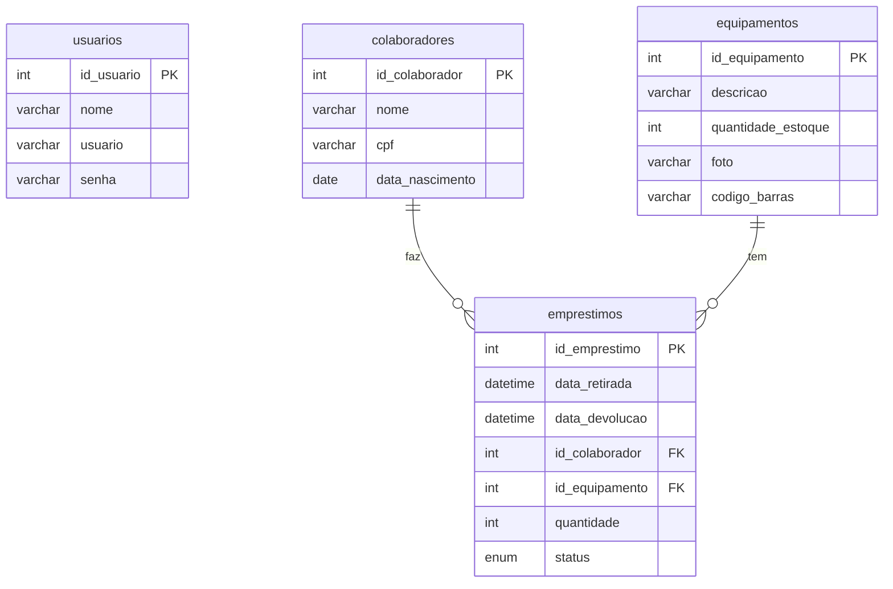

# Diagrama do Banco de Dados EPI

```mermaid
erDiagram
    usuarios {
        int id_usuario PK
        varchar nome
        varchar usuario
        varchar senha
    }
    
    colaboradores {
        int id_colaborador PK
        varchar nome
        varchar cpf
        date data_nascimento
    }
    
    equipamentos {
        int id_equipamento PK
        varchar descricao
        int quantidade_estoque
        varchar foto
        varchar codigo_barras
    }
    
    emprestimos {
        int id_emprestimo PK
        datetime data_retirada
        datetime data_devolucao
        int id_colaborador FK
        int id_equipamento FK
        int quantidade
        enum status
    }
    
    colaboradores ||--o{ emprestimos : faz
    equipamentos ||--o{ emprestimos : tem
```